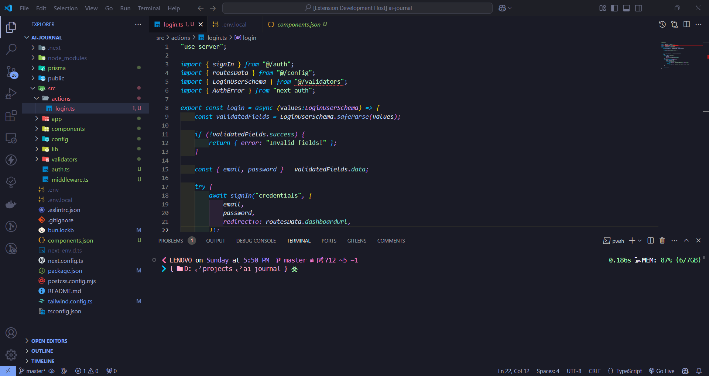

[![contributors]][contributors-url]
[![forks]][forks-url]
[![stars]][stars-url]
[![license]][license-url]

# Da3m0ns Theme

Da3m0ns (pronounced daemons) is a dark theme for Visual Studio Code inspired by the aesthetics of neovim. It features a high contrast color scheme with vibrant accents, designed to reduce eye strain and improve code readability during long coding sessions.

<!-- Table of Contents -->
# 📔 Table of Contents

- [About the Project](#-about-the-project)
  * [Screenshots](#-screenshots)
  * [Features](#-features)
- [Getting Started](#getting-started)
  * [Installation](#-installation)
- [Contributing](#contributing)
- [License](#license)

<!-- About the Project -->
## ✨ About the Project

Da3m0ns theme is designed to be easy to install and customize, allowing developers to tailor the appearance of their coding environment to their personal preferences. The project is open-source and welcomes contributions from the community to enhance and expand its features.

<!-- Screenshots -->
### 📷 Screenshots 

#### Da3m0ns Dark 

#### Da3m0ns Dark Italic 

### 🌟 Features

- **High Contrast**: The theme uses a high contrast color scheme to make code elements stand out, reducing eye strain.
- **Vibrant Accents**: Bright and vibrant accent colors are used to highlight important syntax elements.
- **Customizable**: Easily customizable to fit your personal preferences and coding style.
- **Consistent Design**: Consistent design language across different file types and programming languages.

## Getting Started

To get started with the Da3m0ns theme, follow these simple steps to install it from the Visual Studio Code Extensions marketplace.

### 🚀 Installation

1. Open Visual Studio Code.
2. Go to the Extensions view by clicking on the Extensions icon in the Activity Bar on the side of the window or by pressing `Ctrl+Shift+X`.
3. In the search box, type `Da3m0ns`.
4. Click on the `Da3m0ns` theme from the list of results.
5. Click the `Install` button.
6. Once installed, go to the Command Palette (`Ctrl+Shift+P`) and type `Color Theme`. Select `Preferences: Color Theme` and choose `Da3m0ns` from the list.

Enjoy your new coding environment!

## Contributing

We welcome contributions from the community to help improve the Da3m0ns theme. If you encounter any bugs or have suggestions for new features, please feel free to create an issue on our GitHub repository. Our team will review and address the issues as promptly as possible.

To contribute:

1. Fork the repository.
2. Create a new branch (`git checkout -b feature/YourFeature`).
3. Make your changes.
4. Commit your changes (`git commit -m 'Add some feature'`).
5. Push to the branch (`git push origin feature/YourFeature`).
6. Open a pull request.

Thank you for your contributions!

<!-- License -->
## ⚠️ License 

Distributed under no License. See LICENSE.txt for more information.

<!-- MARKDOWN LINKS -->
[contributors]: https://img.shields.io/github/contributors/TheShiveshNetwork/vscode-da3m0ns
[contributors-url]: https://github.com/TheShiveshNetwork/vscode-da3m0ns/graphs/contributors
[forks]: https://img.shields.io/github/forks/TheShiveshNetwork/vscode-da3m0ns
[forks-url]: https://github.com/TheShiveshNetwork/vscode-da3m0ns/network/members
[stars]: https://img.shields.io/github/stars/TheShiveshNetwork/vscode-da3m0ns
[stars-url]: https://github.com/TheShiveshNetwork/vscode-da3m0ns/stargazers
[open-issues]: https://img.shields.io/github/issues/TheShiveshNetwork/vscode-da3m0ns
[open-issues-url]: https://github.com/TheShiveshNetwork/vscode-da3m0ns/issues/
[license]: https://img.shields.io/github/license/TheShiveshNetwork/vscode-da3m0ns.svg
[license-url]: https://github.com/TheShiveshNetwork/vscode-da3m0ns/blob/master/LICENSE
